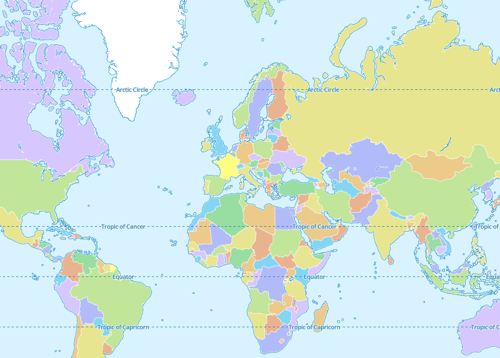
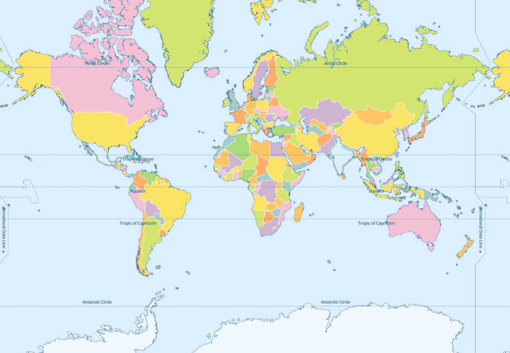
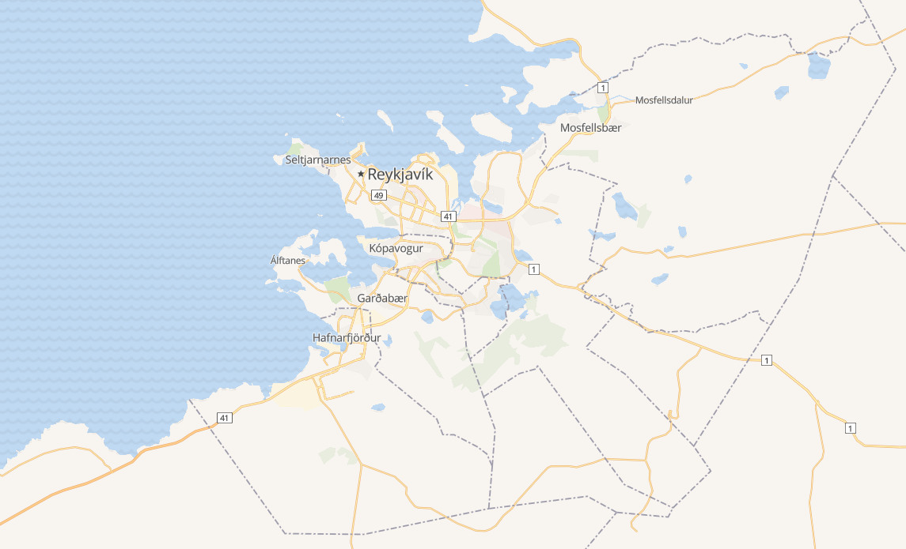
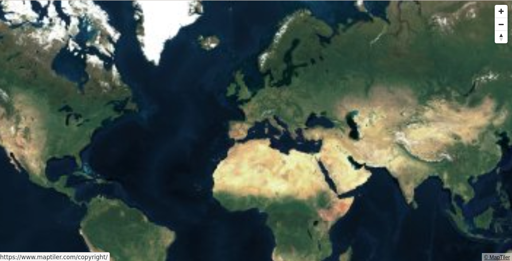

# OpenMapTiles standalone viewer

This repository contains small standalone C programs to display maps using `MapLibre` in offline / air-gapped environments.

Last stage (stage 3) contains the most capable viewer.

Subdirectory `stage1` contains source code for a small C program which can render the world countries offline.
This program is a refactor in C of [mapbox-gl-js-offline-example](https://github.com/klokantech/mapbox-gl-js-offline-example).

Subdirectory stage2 contains an offline mbtiles viewer. It is derived from program in stage1. It can only render vectorial mbtiles.

Subdirectory stage3 contains an improved mbtiles viewer which can render raster mbtiles file too. For vectorial mbtiles file, there is a work in progress feature to dynamically change the rendering style for each displayed layer.

All programs start a local web server and (on Linux) opens the web browser to display the map using `xdg-open`.

I wrote them to understand how to use `MapLibre` and how to build standalone applications using it. *This is not production grade software* but maybe it contains useful examples (they are released in the hope they will). 

## Stage 1 : world map view

Program is build using `make`, the output executable is `world`. Start it directly typing `./world -p 9999 -x` which will start a web server listening on port 9999 and a web browser pointing to URL `http://127.0.0.1:9999`.

The `site` subdirectory contains the whole web site tree. All the web site which includes HTML, CSS, Javascript, fonts and map tiles gets bundled in the final executable which does not have any dependencies. The program `world` can be copied and run onto another machine provided it runs Linux on the same architecture.

Program usage :
~~~~
$ ./world -h
usage: 
	 -h            Prints this help message.
	 -x            Opens web browser.
	 -p port       Sets port number to listen on.
~~~~

Here is a screenshot of what's shown in the web browser :

## Stage 2 : mbtiles viewer

The program is designed to display *vectorial* `mbtiles` files. It is easier to display `mbtiles` files from `openmaptiles` since the program comes with 4 (slightly modified) openmaptiles rendering styles bundled inside (basic, bright, dark and positron). It is still possible to display another `mbtiles` file providing your own `style.json` file, an example of this is available in `data/ex1`.

Program is build using `make`, the output executable is `mbv`. Start it typing `./mbv -p 9999 -x -m data/ex2/iceland.mbtiles -s @bright` which will start a web server listening on port 9999 and a web browser pointing to URL `http://127.0.0.1:9999`.

The `site` subdirectory contains the whole web site tree. All the web site which includes HTML, CSS, Javascript, fonts gets bundled in the final executable which does only depends on `libsqlite3` and `libjson-c`. The program `mbv` can be copied and run onto another machine provided it runs Linux on the same architecture and has the dependencies available.

On a debian 10 buster system, packages `libsqlite3-0` and `libjson-c3` need to be available :
~~~~
$ ldd ./mbv
	linux-vdso.so.1 (0x00007ffdf7925000)
	libjson-c.so.3 => /lib/x86_64-linux-gnu/libjson-c.so.3 (0x00007fd8de85d000)
	libsqlite3.so.0 => /lib/x86_64-linux-gnu/libsqlite3.so.0 (0x00007fd8de73b000)
	libc.so.6 => /lib/x86_64-linux-gnu/libc.so.6 (0x00007fd8de57a000)
	libm.so.6 => /lib/x86_64-linux-gnu/libm.so.6 (0x00007fd8de3f7000)
	libpthread.so.0 => /lib/x86_64-linux-gnu/libpthread.so.0 (0x00007fd8de3d6000)
	libdl.so.2 => /lib/x86_64-linux-gnu/libdl.so.2 (0x00007fd8de3d1000)
	/lib64/ld-linux-x86-64.so.2 (0x00007fd8dea79000)

$ dpkg -S /usr/lib/x86_64-linux-gnu/libsqlite3.so.0
libsqlite3-0:amd64: /usr/lib/x86_64-linux-gnu/libsqlite3.so.0

$ dpkg -S /usr/lib/x86_64-linux-gnu/libjson-c.so.3
libjson-c3:amd64: /usr/lib/x86_64-linux-gnu/libjson-c.so.3
~~~~

Related `libXXX-dev` packages are required for compiling.

Program usage :
~~~~
$ ./mbv -h
usage: 
	 -h            Prints this help message.
	 -x            Opens web browser.
	 -p port       Sets port number to listen on.
	 -m mbtiles    Sets mbtile file to display.
	 -s style      Sets style.json file to use for rendering.
~~~~

### Example 1 : world mbtiles

This example uses data from https://github.com/klokantech/vector-tiles-sample.

~~~~
$ ./mbv -x -p 9999 -m ./data/ex1/countries.mbtiles -s ./data/ex1/style.json
~~~~

You can notice in the file `./data/ex1/style.json` (see below), there is a 'printf formatting directive', the `%1$d` gets replaced with the chosen port number.

~~~~
   ...
   
    "sources": {
	"countries": {
	    "type": "vector",
	    "tiles": ["http://127.0.0.1:%1$d/tiles/{z}/{x}/{y}.pbf"],
	    "maxzoom": 6
	}
    },
    
   ...   
~~~~

Here is a screenshot of what's shown in the web browser :

### Example 2 : iceland mbtiles

This example uses data from [openmaptiles](https://openmaptiles.org/) (see "Credits" for URL) and predefined openmaptiles were downloaded from githb repositories.

~~~~
$ ./mbv -x -m ./data/ex2/iceland.mbtiles -s @bright
~~~~

Predefined styles are identified by their 1st char being `@`. There are `@basic`, `@bright`, `@dark` and `@positron`.

Here is a screenshot of what's shown in the web browser with style `@bright`:

## Stage 3 : render raster mbtiles and customize rendering style

Program usage :

~~~~
$ ./mbv -h
usage: 
	 -h            Prints this help message.
	 -b            Be verbose.
	 -x            Opens web browser.
	 -p port       Sets port number to listen on.
	 -m mbtiles    Sets mbtile file to display.
	 -s style      Sets style.json file to use for rendering.
~~~~

Additional dependency `libz`.

### Example 1 : raster mbtiles rendering

~~~~
$ ./mbv -x -m ./data/ex3/maptiler-satellite-lowres-2018-03-01-planet.mbtiles
~~~~

## Credits

This project depends on work by other people.

 * [http-parser](https://github.com/nodejs/http-parser)
 * [mapbox-gl-js-offline-example](https://github.com/klokantech/mapbox-gl-js-offline-example)
 * [vector-tiles-sample](https://github.com/klokantech/vector-tiles-sample)
 * Iceland map was downloaded from [maptiles](https://data.maptiler.com/downloads/tileset/osm/europe/iceland/)
 * [basic style](https://github.com/openmaptiles/maptiler-basic-gl-style)
 * [bright style](https://github.com/openmaptiles/osm-bright-gl-style)
 * [dark style](https://github.com/openmaptiles/positron-gl-style)
 * [positron style](https://github.com/openmaptiles/dark-matter-gl-style)

## Licensing

As said in previous section this project depends on others people work which get included (for data) and statically linked (for code) in the executables.
As a consequence I believe "MIT license" can be applied to this project since :

 * http_parser has "MIT license"
 * mapbox-gl-js-offline-example same as vector-tiles-sample
 * openmaptiles styles have "BSD 3-Clause License"
 * maplibre-gl-ls has this [license](https://github.com/maplibre/maplibre-gl-js/blob/main/LICENSE.txt)

`mbtiles` samples are not linked or bundled in the executables.

Let me know if something's wrong there ?

